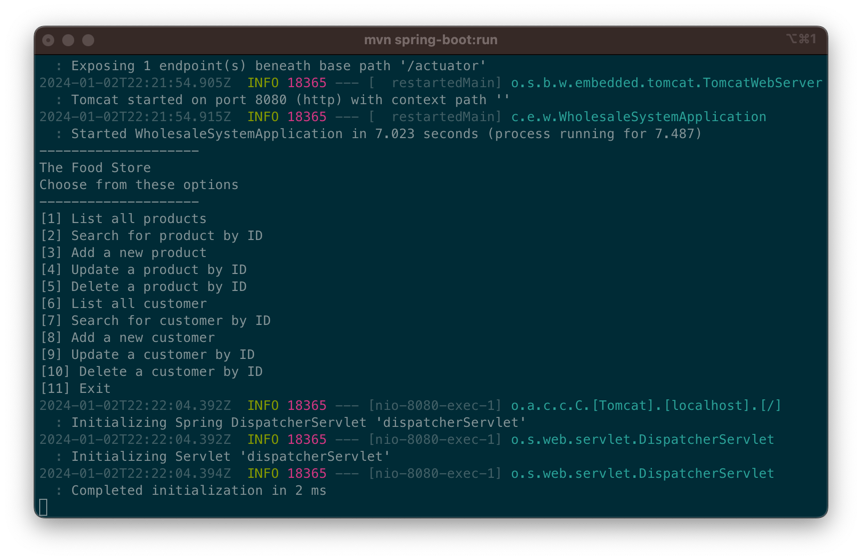

## Wholesale system

- A web-based wholesale stock control system for food products and customers.
- The system allows to do **CRUD** of food products (id, SKU, description, category, price) from SQLite DB.
- The system allows us to do **CRUD** of business customers (business name, address, telephone number) from SQLite DB.
- The system allows one to search food products by description.
- Technology used:

    - Java: Spring boot
    - HTML: Thymeleaf
    - CSS: Tailwind CSS/ daisyUI

## Prerequisite

Step 1: Install Maven

- On Windows:
    1. Download the Maven Binary zip file.
    2. Setting environmentally variable
    3. Check the Maven version with `mvn -v` to check whether the installation is successful.
    4. For more info can refer to this step-by-step instruction: https://phoenixnap.com/kb/install-maven-windows
- On macOS
    1. Install Homebrew(Package Manager for macOS)
       with `/bin/bash -c "$(curl -fsSL https://raw.githubusercontent.com/Homebrew/install/HEAD/install.sh)"`
    2. Install Maven with `brew install maven`

## How to Run the Project

### Run Spring boot application

```shell
mvn spring-boot:run
```

### Running on console

After you run the application, you'll see the following screen:


Enter the number of options to choose which function you want to test

### Running on web

After you run the application, following the steps below:

1. Please start with this URL: http://localhost:8080/login
2. login username and password are:
    - username: test001
    - password: test001

## Folder Structure

- **Project's Instruction:** *wholesale_system/README.md*
- **Food Products:** *wholesale_system/src/**main**/java/com/example/wholesale_system/food_product*
- **Customers:** *wholesale_system/src/**main**/java/com/example/wholesale_system/customer*
- **HTML:** *wholesale_system/src/**main**/resources*
- **Database:** *wholesale_system/src/**database**/wholesale_system.db (The data is hardcoded, all the data will be
  prepared
  in advance)*
- **Unit tests:** *wholesale_system/src/**test**/java/com/example/wholesale_system*
- **JavaDoc:** *wholesale_system/**target**/doc/index.html*

## Credits

Thanks so much for Dr. Conor taught us the Java programme language, the concept of OOP and others knowledge about
developing a web application project.

Also, thanks so much for the documentation of Spring, Springboot, Thymeleaf and TailwindCSS/daisyUI to let me learn how
to do a basic full stack project.

- Spring/ Spring boot: https://spring.io/guides/gs/spring-boot/
- Thymeleaf: https://www.thymeleaf.org/documentation.html
- Tailwind: https://tailwindcss.com/
- daisyUI: https://daisyui.com/